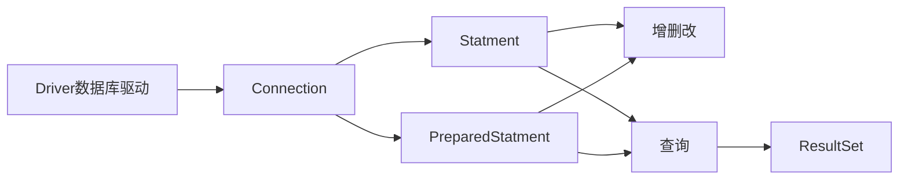

# 第三章：使用PreparedStatment实现CRUD操作

P26-28 查询四六级成绩(还不会创建表/暂时没看)

# PreparedStatment实现表数据的添加操作

PreparedStatment解决的问题:

 - 解决拼串问题
 
 - 可以实现Blob操作

 - 可以实现批量操作

 ORM思想
 * 一个数据表对应一个java类

 * 表中的一条记录对应java的一个对象
 
 * 表中的一个字段对应java的一个属性

 面向接口编程的思想